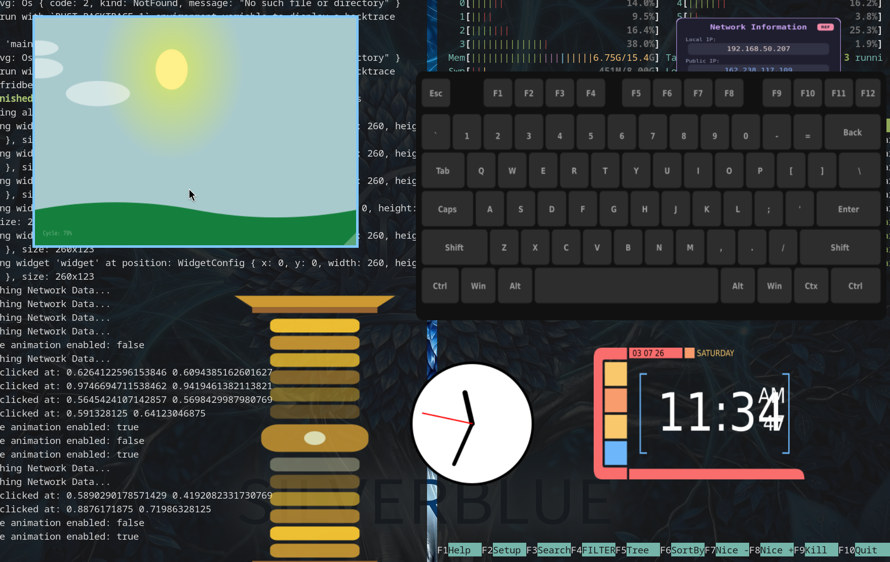

# WayWidgets System

A lightweight, high-performance Wayland widget system that renders SVG templates using Cairo and provides dynamic logic via an embedded JavaScript engine (Boa).



## Features

- **SVG Rendering**: Uses `librsvg` and `cairo` for crisp, vector-based visuals.
- **JS Scripting**: Dynamic updates via a fluent JavaScript API.
- **Interactive**: Built-in support for moving and resizing widgets via the Wayland protocol.
- **Generic**: Run any widget by providing an SVG and a JS script.
- **Multi-format Packaging**: Automated builds for Release Binaries, RPMs, and Flatpaks.

## Simple Widget Creation

Creating a widget is as simple as:
1.  **Providing an SVG**: Design your widget in any vector tool (Inkscape, Illustrator, etc.).
2.  **Writing a JS function**: Add dynamic logic via the `update()` function.
3.  **Running it**: Point the engine at your files. No compilation required.

```bash
# Display a static SVG
waywidget --svg my-widget.svg

# Add interactivity and logic
waywidget --svg my-widget.svg --script logic.js
```

## CLI Usage

### Direct Run
Point the engine at specific SVG and JS files.

| Parameter | Shorthand | Description | Default |
|-----------|-----------|-------------|---------|
| `--svg` | `-s` | Path to the SVG template file | - |
| `--script` | `-j` | Path to the JavaScript logic file | - |
| `--width` | - | Initial window width | `200` |
| `--height` | - | Initial window height | `200` |
| `--position`| - | Initial (x,y) position (e.g. `300,100`) | - |

### Subcommand: `run`
Loads a widget by convention from `~/.config/waywidget/<name>/`.
Expects `widget.svg` and `widget.js` to exist in that directory.

```bash
waywidget run <widget_name> [OPTIONS]
```

| Parameter | Shorthand | Description | Default |
|-----------|-----------|-------------|---------|
| `--name` | `-n` | Custom instance name (for persistent config & stopping) | `<widget_name>` |
| `--width` | - | Initial window width | `200` |
| `--height` | - | Initial window height | `200` |
| `--position`| - | Initial (x,y) position (e.g. `300,100`) | - |

### Subcommand: `stop`
Stops a running widget instance by its name.

```bash
waywidget stop --name <instance_name>
```

## Getting Started

### Prerequisites

Ensure you have the following system libraries installed (Debian/Ubuntu):
```bash
sudo apt install libwayland-dev libcairo2-dev librsvg2-dev libxkbcommon-dev pkg-config
```

### Running Examples

Use the provided helper script to run the examples:

```bash
./run.sh all       # Launch all examples tiled on screen (Ctrl-C to stop)
./run.sh lcars     # Star Trek themed digital clock
./run.sh clock     # Standard analog clock
./run.sh sunrise   # Animated 60-second day/night cycle
./run.sh keyboard  # Interactive 60% mechanical keyboard visualizer
./run.sh warpcore  # Animated vertical reactor core with speed controls
./run.sh ip        # Asynchronous Public & Local IP visualizer
./run.sh lion      # Static geometric lion widget
```

## JavaScript Interaction API

The system looks for a global `update(api, timestamp, response, state, request)` function.

- `api`: The `WidgetAPI` instance for finding elements and manipulating their attributes.
- `timestamp`: The current time in milliseconds (useful for animations).
- `response`: An object containing events and data from the engine:
    - `click`: `{ x: number, y: number }` normalized coordinates, or `null`.
    - `keyboard`: `string[]` of keys pressed (prefixed with `+`) or released (`-`).
    - `http`: `Record<string, { status: number, body: string, error?: string }>` containing async HTTP results.
    - `cli`: `Record<string, { output: string, error?: string }>` containing async CLI results.
- `state`: A persistent `WidgetState` store that survives between `update` calls.
- `request`: A `RefreshRequest` instance used to schedule the next update or trigger network/system calls.

### Example: IP Visualizer (`widget.js`)

```javascript
const CMD = "ip address";

function update(api, timestamp, response, state, request) {
    // 1. Trigger fetch on start or click
    if (state.get("last") === "" || response.click) {
        request.CliInvoke(CMD);
        api.findById("status").setText("Fetching...");
    }

    // 2. Check for async response
    if (response.cli && response.cli[CMD]) {
        const res = response.cli[CMD];
        if (!res.error) {
            const match = res.output.match(/inet\s(\d+\.\d+\.\d+\.\d+)/);
            const ip = match ? match[1] : "No IP";
            api.findById("status").setText(ip);
            state.set("last", ip);
        }
    }

    request.localClickEvents();
    request.refreshInMS(1000);
}
```

### RefreshRequest API

| Method | Description |
|--------|-------------|
| `refreshInMS(ms)` | Requests the next `update()` call in `ms` milliseconds. Clamped to a minimum of `33ms`. |
| `localKeyboardEvents()` | Enables keyboard event capture for the next frame. |
| `localClickEvents()` | Enables mouse click capture for the next frame. |
| `jsonHttpGet(url, headers?)` | Triggers an asynchronous JSON GET request. |
| `jsonHttpPost(url, headers?, body?)` | Triggers an asynchronous JSON POST request. |
| `CliInvoke(command)` | Triggers an asynchronous CLI command (must resolve in 10s). |

### WidgetState API

| Method | Description |
|--------|-------------|
| `get(key)` | Retrieves a string value. Returns `""` if not found. |
| `set(key, value)` | Sets a persistent string value. |
| `getObject(key)` | Retrieves a JSON-deserialized object. Returns `null` if not found. |
| `setObject(key, obj)`| Serializes and stores an object as JSON. |
| `clear(key)` | Removes a key from the persistent state. |
| `setGlobalPersistence(key, val)` | Sets a truly global string value across all widgets (saved to `widgets_states.yml`). |
| `getGlobalPersistence(key)` | Retrieves a global string value. |

### ElementHandle API

| Method | Description |
|--------|-------------|
| `setRotation(angle, cx?, cy?)` | Rotates the element around an optional center point. |
| `setTranslation(x, y)` | Moves the element by (x, y). |
| `setScale(factor)` | Scales the element (1.0 is default). |
| `setText(text)` | Sets the text content of the element. |
| `setAttribute(name, val)` | Sets a raw SVG attribute (e.g. "fill", "r"). |
| `setVisible(boolean)` | Toggles the `display: none` attribute. |
| `setOpacity(0.0-1.0)` | Sets the element's opacity. |
| `addClass(className)` | Adds a CSS class to the element. |
| `removeClass(className)` | Removes a CSS class from the element. |
| `appendElement(tag, attrs)` | Dynamically creates and appends a child SVG element. |
| `clearChildren()` | Removes all child nodes. |
| `remove()` | Removes the element from the SVG tree. |

For full typings, see [examples/widget.d.ts](examples/widget.d.ts).

## Interaction

- **Move**: Left-click and drag anywhere on the widget to move it.
- **Resize**: Hover over the bottom-right corner to reveal the resize handle. Left-click and drag the handle to resize the window.

## Persistence

WayWidgets automatically manages persistence in `~/.config/waywidget/`:

- **`positions.yml`**: Stores the window width and height for each widget instance (by name).
- **`widgets_states.yml`**: Stores global key-value pairs set via `state.setGlobalPersistence()`.
- **`pids/`**: Stores PID files for active widgets, used by the `stop` command.

## Window Manager Configuration

For tiling window managers, you should configure `waywidget` to always open as a floating window.

### Niri
Add to `~/.config/niri/config.kdl`:
```kdl
window-rule {
    match app-id="waywidget"
    open-floating true
}
```

### Sway
Add to `~/.config/sway/config`:
```sway
for_window [app_id="waywidget"] floating enable, border none
```

### Hyprland
Add to `~/.config/hypr/hyprland.conf`:
```hypr
windowrulev2 = float, class:(waywidget)
windowrulev2 = pin, class:(waywidget)
```

## Development & Testing

The system includes a robust suite of unit and integration tests to ensure reliable SVG manipulation and JavaScript integration.

To run the tests:
```bash
cd waywidget
cargo test
```

## Packaging & Build System

The project includes a robust packaging environment based on Podman/Docker.

### Local Build (Binary + RPM + Flatpak)

You can use the provided automation script:
```bash
./docker-build.sh
```

Or run the steps manually:
   ```bash
   podman build -t waywidget-toolchain .
   ```

2. **Run the Packaging Script**:
   ```bash
   podman run --rm \
       --security-opt label=disable \
       --security-opt seccomp=unconfined \
       -v .:/build:Z \
       waywidget-toolchain
   ```
   Artifacts will be available in the `./dest` directory.

### Continuous Integration

Every push to the `main` branch on GitHub triggers an automated build. Artifacts (Binary, RPM, Flatpak) are automatically generated and attached to the GitHub Action run.

## Project Information

- **URL**: https://github.com/maxfridbe/WayWidget
- **Author**: Max Fridbe <maxfridbe@gmail.com>
- **License**: MIT
